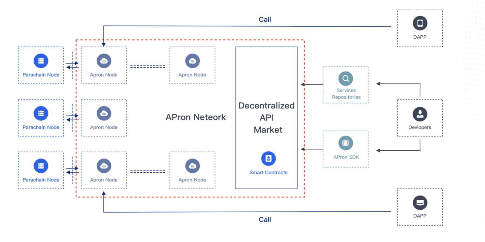

# Usage Scenarios

The decentralized infrastructure service market based on Apron Network is participated by three parties, including infrastructure service providers, DAPP developers and Apron Network builders. Infrastructure service providers have infrastructure service capabilities, which need to be transported to the market for service demanders to use. DAPP developers are application developers. At present and in the future, application development needs to rely on infrastructure services, while DAPP developers themselves do not have the ability or funds to develop corresponding infrastructure services, so DAPP developers need to find the infrastructure services they need. Apron Network Builder mainly refers to the operator of the Apron Node. In Apron Network, the identity of the infrastructure service provider and Apron Network Builder can overlap.

The decentralized infrastructure service market consists of two main parts: market smart contract and front-end. Market smart contract is a smart contract, which is the core of the market. It deals with the demand of the infrastructure service chain, discovery, call and billing. The market front-end is to provide market information display, query, developer information maintenance and other auxiliary functions on the Internet.
