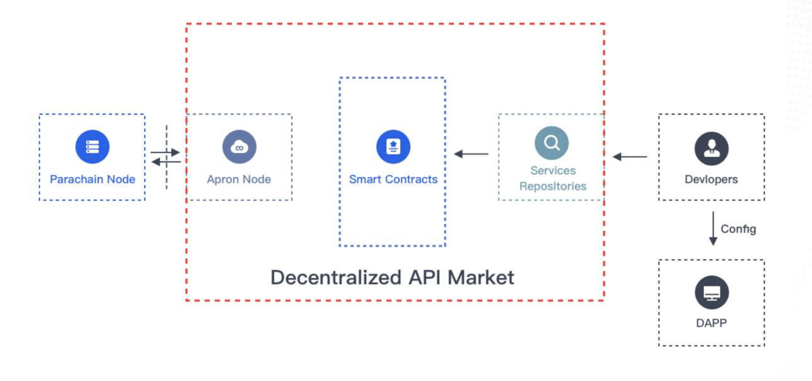

# Sevice Discovery

This is very important for both service providers and service demanders. In the Apron service marketplace, all infrastructure services are presented to service consumers through front-end pages. Service demanders can also retrieve corresponding services in the market or publish a reward for service requirements to find service providers who can provide services.&#x20;

Apron Network will search and check the status of infrastructure services in all markets by introducing the role of the inspector, provide relevant service information to users in Apron Network, and provide dynamic balance function reference in Apron SDK.
