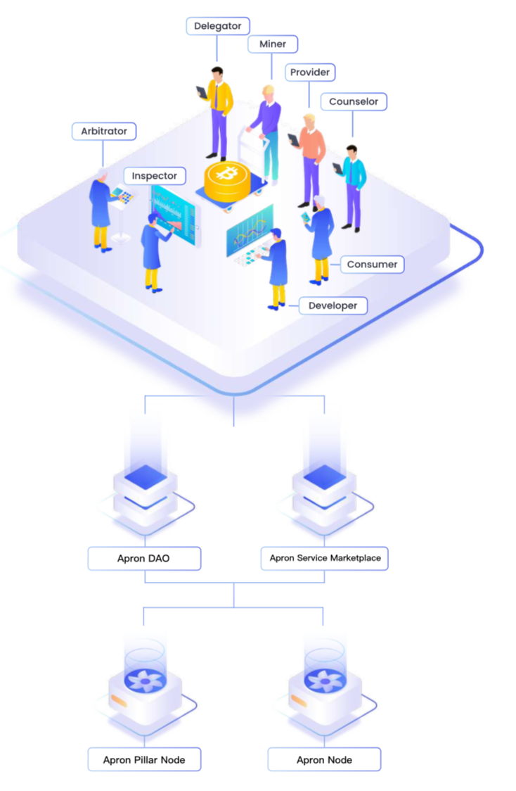

# Overview in System Design

Apron Network is based on substrate framework and can be a parachain of Kusama / Polkadot. The nodes running in Apron Network are divided into two types: Apron Pillar Node, Apron Node. On top of the nodes that can run, Apron DAO manages Apron Network. The entire Apron Network will be composed of Apron Pillar Node, Apron Node, Apron Service Marketplace and Apron SDK.


The roles involved in network construction include Provider (Service Provider), Miner (Node Miner), Delegator (client), Arbitrator (Arbiter), Inspector (Inspector), Consumer (User), Developer (Service Developer) and Counselor (Service Consultant). All roles of Network construction work together through Apron DAO to ensure the stable and continuous operation of the entire Apron Network.
